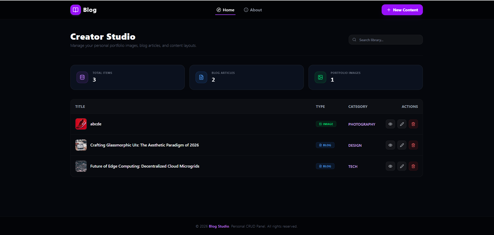

# Creator Studio — Blog & Portfolio Management Dashboard

A modern, responsive dashboard built with **React** and **Redux** for managing personal blog articles, portfolio image assets, and content layouts. Features full CRUD (Create, Read, Update, Delete) capabilities, state management via Redux Toolkit, dynamic search/filtering, and real-time content analytics.

---

## 📸 UI Overview



---

## 🎥 Explanation Video

[](https://drive.google.com/drive/folders/1TburdB_QcmBOnovONcRAj5gCM2euKWbW)

👉 **[Click here to view the project walkthrough video on Google Drive](https://drive.google.com/drive/folders/1TburdB_QcmBOnovONcRAj5gCM2euKWbW)**

---

## 🚀 Key Features

* **Dashboard Analytics Overview**: Real-time counter metrics displaying total content items, total blog articles, and portfolio image counts.
* **Content Management (CRUD)**:
  * Add new blog articles or portfolio images with custom categories (Design, Tech, Photography, etc.).
  * Preview, edit, and delete existing content dynamically.
* **Search & Filter**: Search library by keyword to easily filter content titles.
* **Responsive Dark Theme UI**: Glassmorphism aesthetic with modern dark mode styling.
* **Centralized State Management**: Powered by Redux / Redux Toolkit for seamless data flow.

---

## 🛠️ Tech Stack

* **Frontend**: React.js, JavaScript (ES6+)
* **State Management**: Redux / Redux Toolkit
* **Styling**: CSS3 / Modern Dark Theme UI

---

## 📁 Project Structure

```text
blog-pro/
├── public/
├── src/
│   ├── assets/          # Static assets & images
│   ├── components/      # Reusable UI components (Navbar, StatsCard, Table, Modals)
│   ├── features/        # Redux slices and state logic
│   ├── store/           # Redux store configuration
│   ├── App.jsx          # Root component
│   └── main.jsx         # Entry point
├── package.json
└── README.md